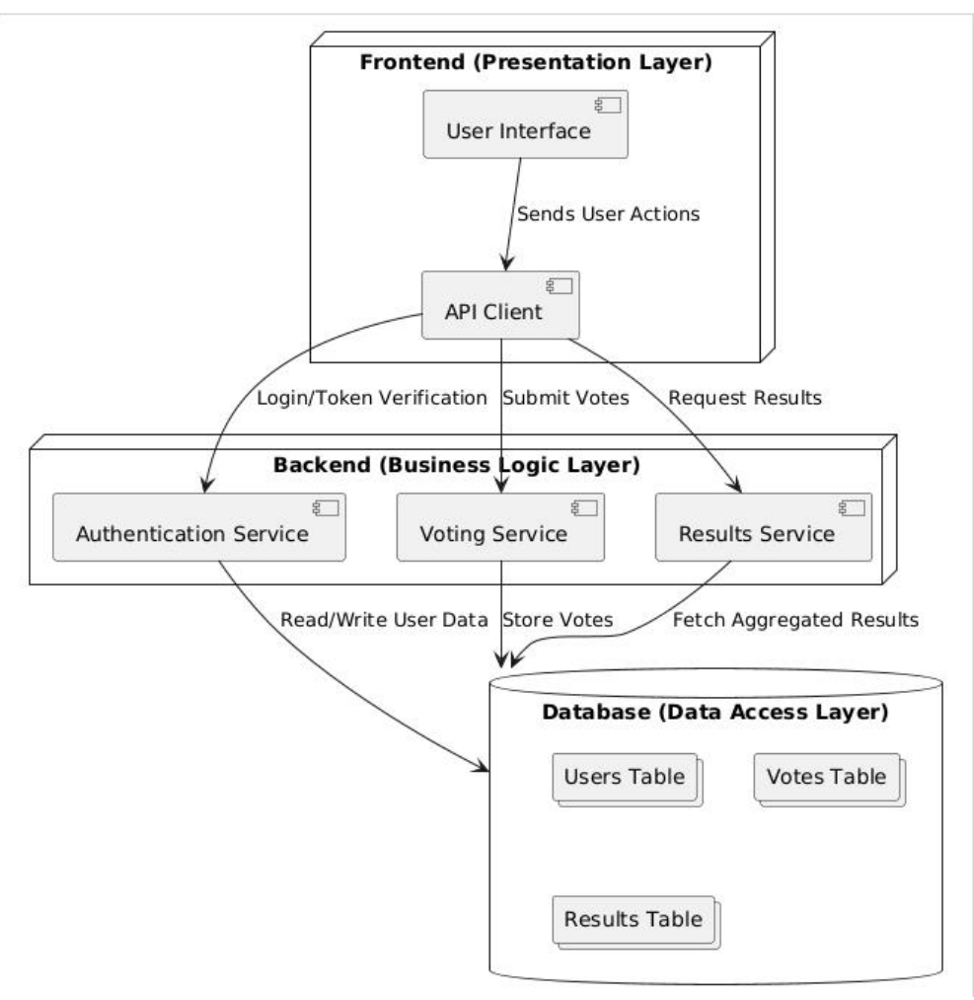
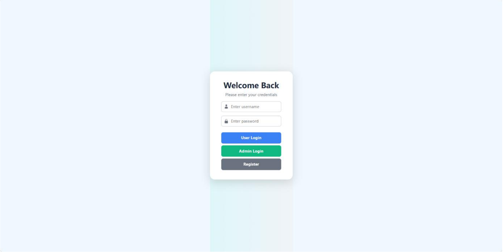
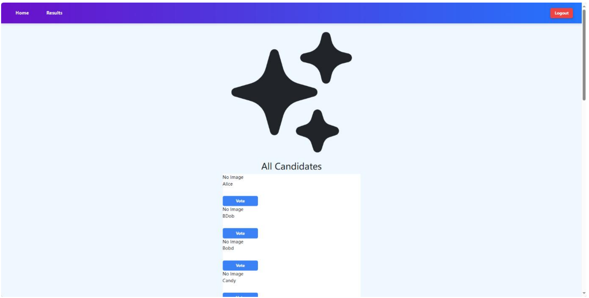
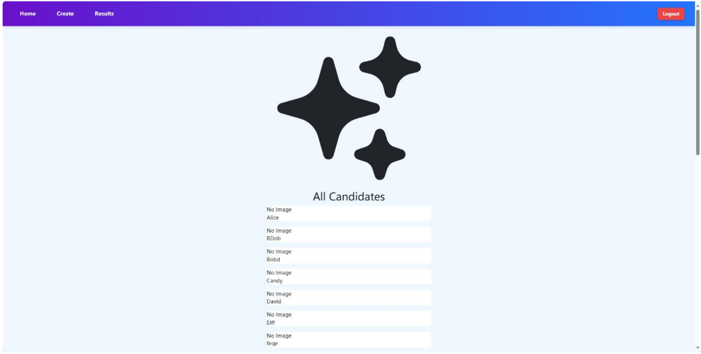
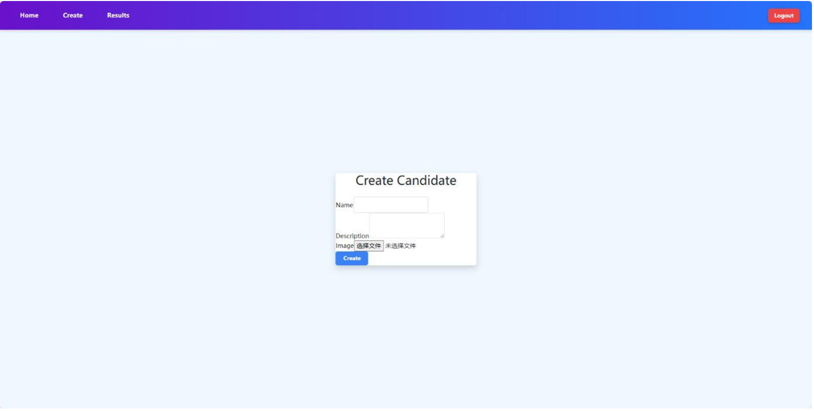
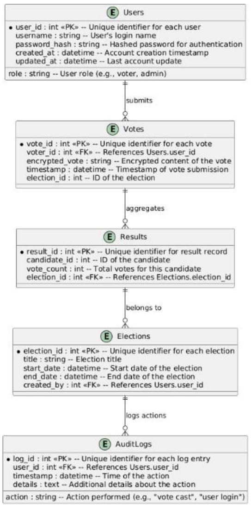

# Online Voting System

A full-stack web application for online voting, built as my final year project. The system allows users to register, log in, view candidates, cast one vote, and check voting results. Admin users can manage candidate information and upload candidate images.

## Tech Stack

**Frontend**

* React
* Axios
* HTML/CSS

**Backend**

* Java
* Spring Boot
* Spring Security
* JWT authentication

**Database**

* MySQL

**Testing**

* Postman
* MySQL Workbench

## Key Features

* User registration and login
* JWT-based authentication
* Role-based access control for admin users
* Candidate browsing and candidate image display
* Vote submission with duplicate-vote prevention
* Voting result aggregation
* Admin candidate management
* API testing with Postman
* Database verification with MySQL queries

## Project Structure

```text
online-voting-system/
├── online-election/          # Spring Boot backend
└── online-voting-frontend/   # React frontend
```

## Screenshots

### System Architecture


### Login Page


### Registration Page


### Candidate List


### Admin Homepage


### Candidate Creation


### Database Design


## Backend Overview

The backend provides RESTful APIs for authentication, candidate management, voting, and result retrieval. Spring Security and JWT are used to protect routes and control access between normal users and admin users.

Main backend functions include:

* User registration and login
* JWT token generation and validation
* Candidate creation and retrieval
* Vote submission
* Duplicate vote checking
* Result aggregation

## Frontend Overview

The frontend is built with React and communicates with the backend through Axios. It provides pages for user login, registration, candidate browsing, voting, and result display.

Main frontend functions include:

* Login and registration forms
* Candidate list display
* Voting button and voting status display
* Result page
* Admin candidate management interface

## Database Design

The system uses MySQL to store user, candidate, and vote information. The main data entities include:

* Users
* Candidates
* Votes

The voting logic is designed to ensure that each user can only vote once. Vote records are stored in the database and used to calculate voting results.

## API Endpoints

| Method | Endpoint | Description |
|---|---|---|
| POST | `/auth/register` | Register a new user |
| POST | `/auth/login` | Authenticate a user and return a JWT token |
| GET | `/auth/me` | Retrieve the current authenticated user |
| GET | `/candidates` | Retrieve all candidates |
| POST | `/candidates` | Create a new candidate with optional image upload, admin only |
| GET | `/users` | Retrieve all user records |
| POST | `/users` | Create a user record |
| POST | `/votes` | Submit a vote for a candidate |
| GET | `/votes/results` | Retrieve aggregated voting results |

Some endpoints require JWT authentication. Candidate creation is restricted to admin users.

## API Testing

Core API workflows were tested using Postman, including:

* User registration
* User login
* Candidate retrieval
* Vote submission
* Duplicate vote prevention
* Result retrieval

Database records were also checked through MySQL queries to verify that user, candidate, and vote data were stored correctly.

## How to Run the Project

### Backend

1. Open the `online-election` folder in IntelliJ IDEA.
2. Configure the MySQL database connection in the Spring Boot application configuration file.
3. Run the Spring Boot application.

### Frontend

1. Open the `online-voting-frontend` folder.
2. Install dependencies:

```bash
npm install
```

3. Start the frontend application:

```bash
npm start
```

## Limitations

This project was developed as an academic final year project. It focuses on core voting system functionality, authentication, database interaction, and API testing. Large-scale stress testing and production-level deployment were not included.

## Future Improvements

* Add more detailed admin dashboard features
* Improve frontend UI design
* Add unit and integration tests
* Add deployment configuration
* Improve error handling and user feedback
* Add more advanced security and audit features
